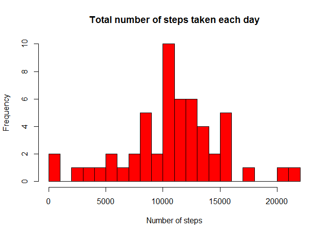
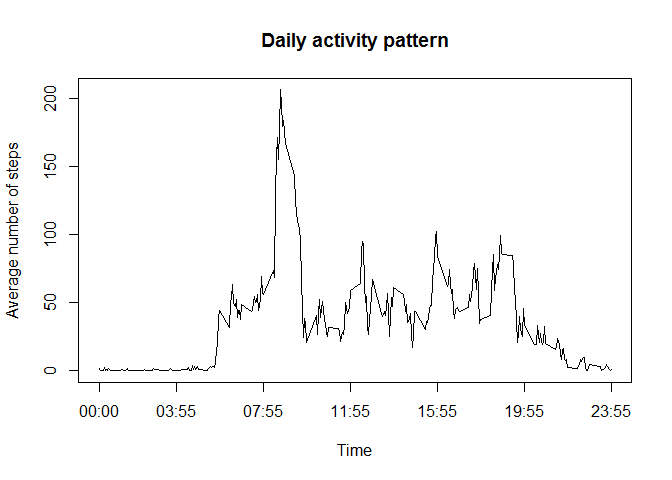
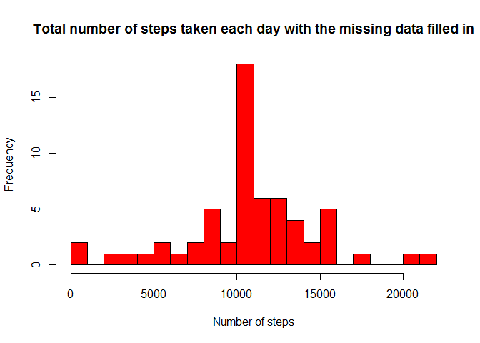
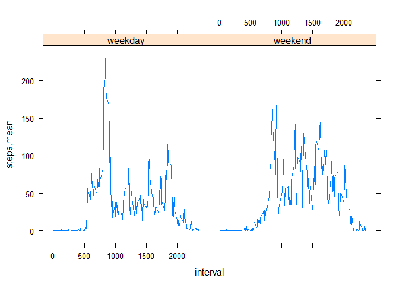

# Reproducible Research: Peer Assessment 1
acourses  
Sunday, October 17, 2014  


## Loading and preprocessing the data

```r
library(doBy)
```

```
## Loading required package: survival
## Loading required package: splines
## Loading required package: MASS
```

```r
library(plyr)
library(lattice)
unzip("activity.zip")
df <- read.csv("activity.csv", header = T, sep = ",")
df$steps <- as.integer(df$steps)
df$date <- strptime(df$date, "%F")
df$datetime <- strptime(paste(df$date, sprintf("%04d", df$interval), sep=" "), format = "%F %H%M")
rows_loaded <- nrow(df)
```

Loaded 17568 rows of data.

## What is mean total number of steps taken per day?


```r
data_summary <- summaryBy(steps ~ date, data=df, FUN=c(sum))

# Make a histogram of the total number of steps taken each day
hist(data_summary$steps.sum, breaks = 16, col="red",
     main ="Total number of steps taken each day",
     xlab = "Number of steps")
```

 

```r
# Calculate and report the mean and median total number of steps taken per day
mean_steps <- as.integer(mean(data_summary$steps.sum, na.rm = T))
median_steps <- as.integer(median(data_summary$steps.sum, na.rm = T))
```
Mean total number of steps per day is 10766.

Median total number of steps per day is 10765.


## What is the average daily activity pattern?


```r
day_summary <- summaryBy(steps ~ interval, data=na.omit(df[,c(3, 1)]), FUN=mean)
plot(day_summary, type="l", xaxt="n",
     xlab="Time", ylab="Average number of steps",
     main = "Daily activity pattern")

pretty_int <- function(interval) {
    format(strptime(sprintf("%04d", interval), format = "%H%M"), "%H:%M")    
}

x_ticks <- quantile(day_summary$interval, 0:6/6, type = 3)
x_labels <- pretty_int(x_ticks)
axis(1, at=x_ticks, labels = x_labels)
```

 

```r
max_steps <- day_summary[day_summary$steps.mean == max(day_summary$steps.mean),]
max_steps_time <- pretty_int(max_steps$interval)
```

The interval 835 (or 08:35) contains the maximum number of steps on average across all the days in the dataset, 206.1698113 steps.


## Imputing missing values


```r
nas <- df[is.na(df$steps),]
nas_count = nrow(nas)
```
The total number of rows with NAs is 2304.


The missing values in the dataset will be replaced with mean value for that 5-minute interval.


```r
df_without_na <- within(
    join(df, day_summary, by = "interval"),
    steps <- ifelse(is.na(steps), steps.mean, steps))

data_summary2 <- summaryBy(steps ~ date, data=df_without_na, FUN=c(sum))

# Make a histogram of the total number of steps taken each day
hist(data_summary2$steps.sum, breaks = 16, col="red",
     main ="Total number of steps taken each day with the missing data filled in",
     xlab = "Number of steps")
```

 

```r
mean_steps_without_na <- as.integer(mean(data_summary2$steps.sum, na.rm = T))
median_steps_without_na <- as.integer(median(data_summary2$steps.sum, na.rm = T))
```
Mean total number of steps per day with the missing data filled in is 10766.
Median total number of steps per day with the missing data filled in is 10766.

Mean total number of steps per day with the missing data filled didnt change, median value changed insignificantly. The histogram shape remained mostly the same, but estimated frequency of mean value increased by more than 50% .


## Are there differences in activity patterns between weekdays and weekends?


```r
df_without_na$wday <- factor(ifelse(df_without_na$date$wday %in% c(0,6), "weekend", "weekday"))
day_summary2 <- summaryBy(steps ~ interval + wday, data=df_without_na, FUN=mean)
xyplot(steps.mean ~ interval | wday, data=day_summary2, type="l")
```

 

The weekday and weekend patterns clearly different, weekdays plot has a peak around 800-900 interval that weekends plot doesnt.


