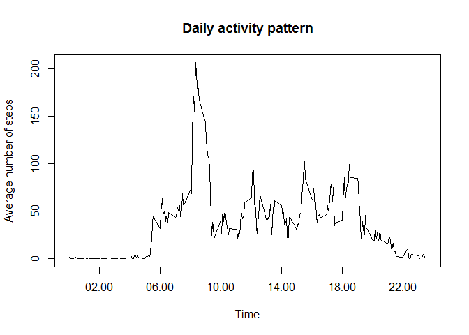

# Reproducible Research: Peer Assessment 1
acourses  
Sunday, September 14, 2014  


## Loading and preprocessing the data

```r
library(doBy)
```

```
## Loading required package: survival
## Loading required package: splines
## Loading required package: MASS
```

```r
unzip("activity.zip")
df <- read.csv("activity.csv", header = T, sep = ",")
df$steps <- as.integer(df$steps)
df$date <- strptime(df$date, "%F")
df$datetime <- strptime(paste(df$date, sprintf("%04d", df$interval), sep=" "), format = "%F %H%M")
rows_loaded <- nrow(df)
```

Loaded 17568 rows of data.

## What is mean total number of steps taken per day?


```r
data_summary <- summaryBy(steps ~ date, data=df, FUN=c(sum))

# Make a histogram of the total number of steps taken each day
hist(data_summary$steps.sum, breaks = 16, col="red",
     main ="Total number of steps taken each day",
     xlab = "Number of steps")
```

 

```r
# Calculate and report the mean and median total number of steps taken per day
mean_steps <- as.integer(mean(data_summary$steps.sum, na.rm = T))
median_steps <- as.integer(median(data_summary$steps.sum, na.rm = T))
```
Mean total number of steps per day is 10766.

Median total number of steps per day is 10765.


## What is the average daily activity pattern?


```r
day_summary <- summaryBy(steps ~ interval, data=na.omit(df[,c(3, 1)]), FUN=mean)
plot(day_summary, type="l", xaxt="n",
     xlab="Time", ylab="Average number of steps",
     main = "Daily activity pattern")

x_ticks <- c(200, 600, 1000, 1400, 1800, 2200)
x_labels <- format(strptime(sprintf("%04d", x_ticks), format = "%H%M"), "%H:%M")
axis(1, at=x_ticks, labels = x_labels)
```

 

```r
max_steps_interval <- day_summary[day_summary$steps.mean == max(day_summary$steps.mean),]$interval
```

The interval 835 contains the maximum number of steps on average across all the days in the dataset.


## Imputing missing values


```r
nas <- df[is.na(df$steps),]
nas_count = nrow(nas)
```
The total number of rows with NAs is 2304.


The missing values in the dataset will be replaced with mean value for that 5-minute interval.


```r
interval_mean <- function (x) {
    day_summary[day_summary[,1]==x, 2]
}
```


## Are there differences in activity patterns between weekdays and weekends?


